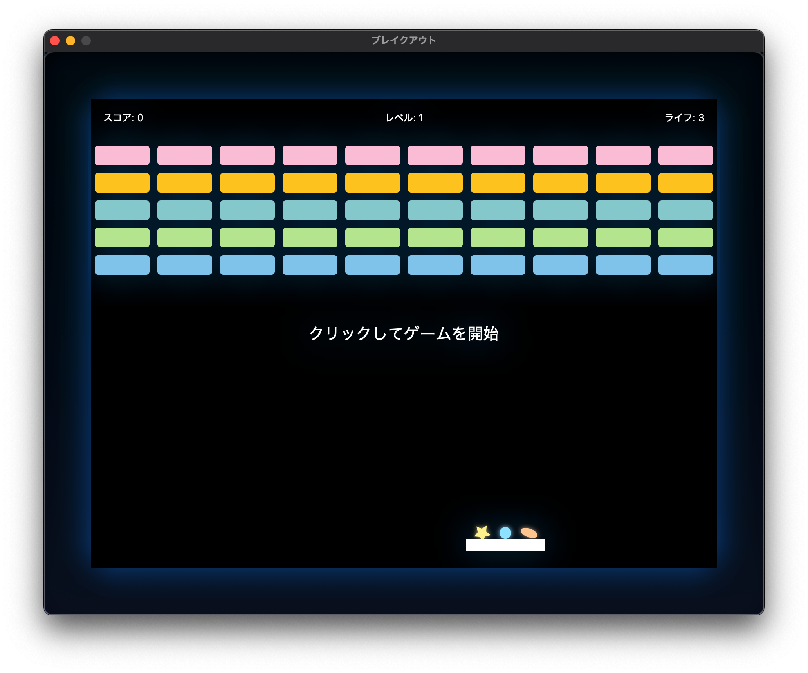

# Breakout Game

macOS向けのブロック崩しゲームの実装です。

## 仕様

* 開発環境：Xcode 15.0以上
* 言語：Swift 6.0
* フレームワーク：SwiftUI
* 非同期処理：Swift Concurrency
* 対応OS：macOS 14以上
* ウィンドウサイズ：800x600ピクセル

## ゲーム要素

1. パドル：
   * 幅100ピクセル、高さ15ピクセル、白色
   * マウス/タッチパッドで水平移動操作
   * 左右矢印キーでも操作可能
   * 楕円形ボールがブロックを崩すたびに幅が1ピクセルずつ縮小（最小で元のサイズの半分まで）
2. ボール：
   * 直径15ピクセル、形状ごとに異なるパステルカラー
     * 星型：黄色のパステル（ブロックごとにコンボカウント増加）
     * 円形：水色のパステル（ブロック衝突で徐々に成長）
     * 楕円形：オレンジ色のパステル（ブロック衝突でパドルを縮小）
   * 物理演算に基づいた移動と反射
   * パドルとの衝突位置によって反射角度が変化
   * 星型と楕円形のボールは移動中に回転
   * 画面下部に落下したボールは自動的に復活
   * ボール同士も衝突して跳ね返る
3. ブロック：
   * 5行10列で配置
   * 行ごとに異なる和風の色
     * 桜色（さくらいろ）- 淡いピンク色
     * 山吹色（やまぶきいろ）- 明るい黄色
     * 浅葱色（あさぎいろ）- 明るい青緑色
     * 萌黄色（もえぎいろ）- 鮮やかな黄緑色
     * 空色（そらいろ）- 明るい青色
   * 10秒ごとに上部に新しい行が自動追加（出現アニメーション付き）
   * 既存のブロックは下方向に移動（移動アニメーション付き）
4. ゲームロジック：
   * 初期ライフ3回
   * ブロック破壊：10点
   * スターコンボによるブロック破壊：20点（ボーナス加算）
   * レベルクリア（全ブロック破壊）：100点ボーナス
   * ボールを落とすとライフ減少
   * ライフ0でゲームオーバー
   * 全ブロック破壊で次レベル（ブロック再配置）
   * ブロックが画面下端に到達するとゲームオーバー
   * レーザーがパドルにヒットすると一時的にゲームがフリーズ
5. ビジュアルエフェクト：
   * ボールとレーザーの残像表示
     * 星型・楕円形ボールは本体の70%サイズで表示
     * 円形ボールは成長に合わせて残像サイズも拡大（本体の90%サイズ）
     * 透明度0.1〜0.3の範囲で設定
   * パドル衝突エフェクト
   * ブロック破壊エフェクト
   * レベルアップ演出
   * スターコンボ達成時の特殊エフェクト（1.5秒間表示）
   * レーザー衝突時の画面フラッシュ
   * すべてのエフェクトにパーティクル効果とブレンドモードを使用
6. 特殊機能：
   * 星型ボールのコンボシステム
     * ブロックに当たるごとにコンボカウント増加
     * 7回のヒットでコンボ達成（同じ色のブロックを一掃）
     * コンボカウントリセット条件：パドルに当たった時、画面外に出た時、ゲームリセット時
   * 楕円形ボールの縮小機能
     * ブロックに当たるごとにパドルの幅が1ピクセルずつ縮小
     * 最小で元のサイズの半分まで縮小
     * パドルサイズリセット条件：楕円ボールが画面外に出た時、全ボール落下時、レベルアップ時、ゲームリセット時
   * 複数ボール同時プレイ
     * 3つの異なる形状のボールがプレイ可能
     * ボール同士も衝突して跳ね返る
   * レーザー射出機能（ブロック破壊時に下向きに発射）

## アーキテクチャ

* MVVMパターン
* GameStateクラス（ObservableObject）でゲーム状態管理
* ContentViewとGameViewでUI構築
* 60FPSでのゲームループ実装（Timer.publishとCombine使用）

## ゲームの操作方法

* マウス/トラックパッド：パドルを移動
* 左右矢印キー：パドルを移動
* クリック：ゲーム開始とボール発射
* スペースキー：ゲーム開始、ボール発射、ゲームオーバー時にリスタート

## パフォーマンス最適化

* フレームレート非依存のアニメーション実装
* GPU描画の活用（drawingGroup修飾子）
* メモリ使用量の最適化
  * 配列操作の効率化（removeAll(keepingCapacity: true)）
  * キャパシティの予約（reserveCapacity）
  * 定数の効率的な定義
* 条件付きレンダリングによる描画負荷軽減
* キャッシュヒントの最適化（cacheHint修飾子）
* 残像エフェクトの最適化（処理量と視覚効果のバランス）
* .blendMode修飾子の効率的な利用
* エフェクト描画の最適化（パーティクル数と品質の調整）

## アクセシビリティ対応

* キーボードナビゲーションのサポート
* 適切なコントラスト比の確保
* VoiceOverサポート（accessibilityLabel, accessibilityHint）
* スケール効果とアニメーションの調整
* 視覚的フィードバックの強化

## 今後の拡張予定

* サウンドエフェクト追加
* 追加のパワーアップアイテム
* オンラインスコアボード
* ユーザー設定（難易度調整、アクセシビリティオプション）

## ビルド方法

1. Xcodeでプロジェクトを開く
2. ビルドターゲットを「My Mac」に設定
3. Command+R キーでビルド実行

## トラブルシューティング

* 画面が表示されない場合：macOS 14以上であることを確認してください
* パフォーマンスが低下する場合：他のアプリケーションを閉じてリソースを確保してください
* クラッシュする場合：最新のXcodeと最新のOS更新が適用されていることを確認してください
* ビジュアルエフェクトが表示されない場合：グラフィックドライバを最新バージョンに更新してください
* キーボード操作が効かない場合：フォーカスが正しくアプリに当たっていることを確認してください

## 技術情報

* 物理演算：カスタム実装の2D物理エンジン
* 衝突検出：形状ベースの最適化されたアルゴリズム
* レンダリング：SwiftUIとMetal（drawingGroup経由）
* パフォーマンス目標：60FPS以上（推奨環境）
* メモリ使用：約100MB以下

# 変更履歴・実装上の注意点（2024年6月）

## 1. ゲームオーバー・失敗時のヒント表示

* ゲームオーバーや全ボール落下・レーザー衝突時に攻略ヒントが必ず表示されます。
* ヒントは `GameHints.plist` から `Codable` 構造体として読み込み、`PropertyListDecoder` でデコードします。
* ヒントは連続して同じものが表示されないようにランダム選出時に直前のヒントと重複しない工夫をしています。

## 2. ヒント管理の実装

* ヒントは `GameHint` 型で管理し、`GameState` 内で配列として保持します。
* ヒントデータは `GameHints.plist` で管理し、2件以上のヒントが必須です。
* 不正なデータや1件のみの場合はアプリ起動時にクラッシュします。

## 3. 1型1ファイル分割方針

* すべてのView/Shape/構造体/enumは「1型1ファイル」とし、`GameView.swift` などの巨大ファイルから厳密に分割しています。
* 入れ子型は `extension` で分離、`private`/`fileprivate` 型は同一ファイル内に残す方針です。
* 元の型定義直前のコメントや実装内コメントも忠実に移植しています。

## 4. View/Shape/構造体/enumの分割・コメント移植

* すべての型について、元の `GameView.swift` のソース・コメント・UI・ロジックが完全一致するように分割ファイルを上書きしています。
* コメントやUIの細部も忠実に反映しています。

## 5. AllBallsLostMessageView/LaserHitMessageViewの進行仕様

* これらのメッセージは「クリックのみで進行」します。
* 一定時間経過後に自動で進むタイマー機能は完全に廃止されています。
* GameStateの該当タイマー変数・ロジックも物理的に削除済みです。

## 6. GameStateのタイマー自動進行ロジック廃止

* `allBallsLostMessageTimer` および `laserHitMessageTimer` など、メッセージ自動消去用タイマーのプロパティ・ロジック・初期化・参照・コメントをすべて削除しました。
* 進行は必ずユーザーのクリック操作のみで行われます。

## 7. macOSでウィンドウを閉じたときのアプリ終了

* `AppDelegate.swift` を新規作成し、`applicationShouldTerminateAfterLastWindowClosed` を実装。
* `BreakoutApp.swift` で `@NSApplicationDelegateAdaptor(AppDelegate.self)` を登録。
* これによりウィンドウを閉じるとアプリが即座に終了します。

## 8. 楕円ボールの物理挙動の改良

* 楕円ボールの反射角計算を物理的にリアルな挙動になるよう完全に改良しました。
* 楕円の回転角度と長軸・短軸の向きを考慮した反射計算を実装：
  * 壁との衝突：長軸・短軸の向きと衝突面の法線ベクトルの関係から反発係数と反射角を計算
  * パドルとの衝突：楕円の向きに応じた反発と偏向角度を計算
  * ブロックとの衝突：形状に基づく物理挙動の差別化
* 特徴的な反射特性：
  * 長軸が衝突面に平行な場合：弱い反発（0.5倍）
  * 短軸が衝突面に平行な場合：強い反発（最大2.3倍）
  * 偏向角度：楕円の向きに応じて-π/6〜π/6の範囲で偏向
  * 速度変化：形状と衝突方向に応じて0.9〜1.1倍の速度変化
* 現実世界の楕円形物体の挙動に近い、予測が難しい反射パターンを実現

## 9. その他設計・実装上の注意点

* 設計方針・実装・コメント・UI・ロジックすべてを元実装と完全一致させることを徹底しています。
* SwiftUIの最新API・macOS 14以降の仕様に準拠しています。
* 主要な型（GameHint, Paddle, Ball, Block, Laser, BallShape, DummySoundManager等）はすべて個別ファイルで管理。
* すべてのView/Shape/構造体/enumの分割・コメント移植・追加仕様対応を段階的に実施。

## 10. ボール復活機能の改良（2024年7月）

* 復活ボールのアニメーション実装：
  * 画面外から目標位置（パドル上）への滑らかな移動アニメーション
  * イージング関数（easeOutCubic）による自然な動きの実現
  * 復活中のボールに輝くリングエフェクトを追加
  * パドル移動に合わせて復活ボールの目標位置も追従するよう改善
* 画面外ボールの非表示化：
  * 条件分岐を追加し、画面外のボールは表示されないよう最適化
  * 復活カウントダウン中または画面表示領域から離れたボールを非表示に
  * 残像も画面外にあるものは表示しないよう処理を改善
* バグ修正：
  * 復活アニメーション中にボールが再度カウントダウン設定される問題を修正
  * 復活アニメーション中にパドルの移動を追従する処理の改善
  * 30秒経過後に復活しない問題を修正（強制復活の閾値を導入）
* パフォーマンス改善：
  * 復活待ちボールを完全に画面外に配置（画面下だけでなく左側にも移動）
  * 残像履歴のクリアによるメモリ使用量の最適化

## 11. 楕円ボールの物理挙動の高度化（2024年7月）

* 物理法則に基づいた反射計算の実装：
  * 楕円の回転角度と長軸・短軸の向きを考慮した反射角度計算
  * 長軸・短軸の向きに応じた反発係数の動的調整（0.5倍〜2.3倍）
  * 形状に基づく偏向角度の計算（-π/6〜π/6の範囲で反射角変化）
* 衝突面との関係性に基づく挙動の差別化：
  * 長軸が衝突面に平行：弱い反発（0.5倍）で緩やかな反射
  * 短軸が衝突面に平行：強い反発（最大2.3倍）で鋭い反射
  * 中間的な向きでは角度に応じた反発と偏向を計算
* 速度変化のリアルな表現：
  * 形状と衝突方向に応じて0.9〜1.1倍の速度変化
  * 短軸方向の衝突ほど大きなランダム性（0.1〜0.3の範囲）
  * 実際の物理挙動に近い予測困難性の実現
* 特殊なケースへの対応：
  * ボール同士の衝突時の形状考慮（偏向と反発の調整）
  * パドル衝突時の回転角度を考慮した反射角計算
  * 壁衝突時の形状と角度に応じた反発挙動の詳細な実装

